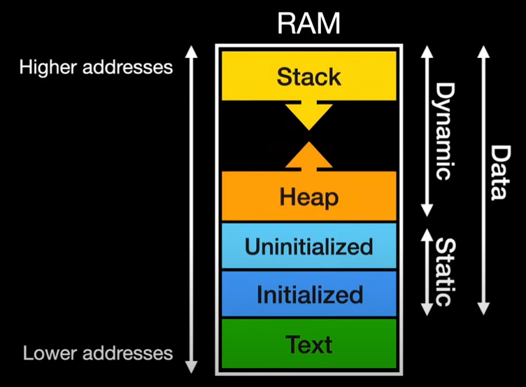

# c++ exercising

> 저는 현장에서 java, c#, javascript, python 등 다양한 언어를 사용하고 있지만, 
> 가장 기본이 되는 언어는 C/C++ 언어라고 생각합니다.
> C언어에서 구현했던 소스들을 C++ 소스코딩을 하여 정리 했습니다.
> 이 저장소는 C++언어의 다양한 예제를 통해 학습하고자 하는 분들에게 도움이 되고자 합니다.

##  ✨  Project 구조

- main.cpp 내 메뉴구조체를 선언 하고  메뉴배열을 만들어 사용합니다.
- 한습이 진행되는 동안 각 학습 주제별 소스를 생성한 후 메뉴구조체 배열의 요소로 추가하여
- 사용자가 선택하여 실행 되도록 합니다.

```
# JSON 라이브러리 추가
# ++에는 기본 JSON 라이브러리가 없으므로, 
# 널리 사용되는 헤더 파일 하나로 구성된 nlohmann/json 라이브러리를 사용
# 다운로드: 이 링크를 클릭하여 json.hpp 파일을 다운로드하세요.
# 파일 이동: 다운로드한 json.hpp 파일을 프로젝트의 include 폴더 안으로 옮겨주세요.
# Single-Header 버전 사용: 모든 코드가 하나의 거대한 json.hpp 파일에 포함되어 있어, 
# 이 파일 하나만 있으면 다른 파일 없이도 라이브러리를 사용할 수 있습니다.

https://github.com/nlohmann/json/releases
```

---

```
# Project 기본 구조
cppEx/
├── .vscode/
│   ├── launch.json
│   └── tasks.json
├── bin/
├── include/
│   ├── helloEx.h
│   └── vectorEx.h
├── src/
│   ├── helloEx.c
│   ├── main.cpp
│   └── vectorEx.cpp
├── Makefile
└── README.md
```

---

##  ✨ .vscode/tasks.json

```
    Purpose

    Encapsulates shell commands (compile, run linters, generate docs) as named tasks the editor can run.
    Let VS Code show build output and link errors to the editor via problem matchers.
    Contract (simple)

    Inputs: active file(s) or workspace variables (e.g. ${file}, ${workspaceFolder}), the compiler command and args.
    Output: compiled binary (or other generated artifacts), and compiler diagnostics surfaced in Problems panel.
    Error modes: task fails (non-zero exit) and problem matcher parses errors; VS Code shows diagnostics.
    Success criteria: binary created at expected path, Problems panel either empty or shows parseable errors.
    Key fields you’ll commonly use

    version: tasks schema version (usually "2.0.0").
    tasks: array of task definitions.
    label: task name (used by preLaunchTask and UI).
    type: "shell" (runs a shell command) or "process".
    command: command to run (e.g., clang++).
    args: array of arguments; use variables like ${file}, ${fileDirname}, ${fileBasenameNoExtension}.
    group: marks task as build/test (so Cmd+Shift+B picks default).
    problemMatcher: e.g. "$gcc" so clang/clang++ errors are clickable.
    options.cwd: working directory for the command.
    presentation: controls terminal visibility.
    isBackground: for watch tasks.

```

```json
    {
        "version": "2.0.0",
        "tasks": [
            {
            "label": "build project",
            "type": "shell",
            "command": "clang++",
            "args": [
                "-std=c++17",
                "-O0",
                "-g",
                "-Wall",
                "-o",
                "${workspaceFolder}/main",
                "${workspaceFolder}/*.cpp",
                "${workspaceFolder}/*.c"
            ],
            "group": {
                "kind": "build",
                "isDefault": true
            },
            "problemMatcher": ["$gcc"],
            "detail": "Compile all .cpp and .c files in the project with clang++"
            }
        ]
    }
```

```
    How to use
    Open a C++ file and press Cmd+Shift+B to run the build task (creates executable next to the source file).
    Reference label from launch.json as preLaunchTask so debugging automatically builds.

    Edge cases / tips
    Ensure your compiler is on PATH (e.g. xcode-select --install) or use full path clang++.
    If you install LLVM from Homebrew, point to that compiler explicitly or update PATH.
    Use problemMatcher so errors become clickable; if mismatch, you won’t get clickable errors.

```


##  ✨ .vscode/launch.json


```
    Purpose

    Defines how VS Code starts or attaches a debugger to your program.
    Stores multiple debug configs (launch variants, attach-to-process, remote, core dump).
    Contract (simple)

    Inputs: path to compiled program (program), optional preLaunchTask, debugger type (lldb/cppdbg), program arguments.
    Output: debugger session where you can set breakpoints, inspect variables, step.
    Error modes: missing binary, missing debug symbols, or mismatched debugger type cause failures.
    Success criteria: breakpoints hit, variables visible, program controllable from VS Code.
    Key fields you’ll commonly use

    version: schema version (usually "0.2.0").
    configurations: array of debug configs.
    name: shown in run/debug dropdown.
    type: "lldb" (CodeLLDB) or "cppdbg" (Microsoft C++ debugger). On mac, lldb (CodeLLDB) is recommended.
    request: "launch" or "attach".
    program: path to executable (use variables like ${fileDirname}/${fileBasenameNoExtension} or ${workspaceFolder}/bin/myprog).
    args: program command-line args.
    cwd: working directory (often ${workspaceFolder} or ${fileDirname}).
    preLaunchTask: label of a task from tasks.json to run before launching (typically your build task).
    stopOnEntry / stopAtEntry: whether to pause at start.
    env: environment variables.
    externalConsole / runInTerminal: whether to open a separate terminal for I/O.
```

```json
    {
        "version": "0.2.0",
        "configurations": [
            {
            "name": "Launch Project (lldb)",
            "type": "lldb",
            "request": "launch",
            "program": "${workspaceFolder}/main",
            "args": [],
            "cwd": "${workspaceFolder}",
            "preLaunchTask": "build project",
            "stopOnEntry": false
            }
        ]
    }
```

```
    Type choice: lldb vs cppdbg

    lldb (CodeLLDB extension) — easy to use on macOS, modern UI, fast.
    cppdbg (ms-vscode.cpptools) — cross-platform, supports GDB/LLDB via MIMode; requires more config (MIMode, miDebuggerPath) to use LLDB properly.

    Common pitfalls
    Debugger says binary not found: check program path and that preLaunchTask produced the executable there.
    Breakpoints are ignored: ensure binary built with -g and -O0 (debug symbols, no optimization).
    preLaunchTask label mismatch: the label in tasks.json must exactly match.
    Path variables: ${file} vs ${workspaceFolder} — use ${fileDirname} for single-file launches.


    How to use
    Press F5 to run the selected configuration.
    Use preLaunchTask to build before debugging automatically.
    Set a breakpoint in the editor and run; the debugger should stop there.

    Example workflow for your main.cpp (copy-and-paste)
    Build from terminal (manual quick test):

    $ clang++ -std=c++17 -O0 -g -Wall -o main main.cpp
    # ./main


    VS Code (automated)

    Add tasks.json with a task labeled e.g. "build active file".
    Add launch.json referencing that preLaunchTask.
    Open main.cpp, press Cmd+Shift+B to build, or press F5 to build+debug.
```

## Getting Started
1. Clone the repository to your local machine.
2. Navigate to the directory containing the examples.
3. Compile all example using `make` command.
4. Run the compiled executable ( ./main ) to see the output.
---



```c
// Contents

MenuItem menu_items[] = {
    {"Hello World", say_hello},                                              // Example function from helloEx.c
    {"Data Types Example", data_typesEx},                                    // Example function from data_typesEx.cpp
    {"Preprocessor Directives Example", preprocessor_directivesEx},          // Example function from preprocessor_directivesEx.cpp
    {"Bit Manipulation Example", bit_manipulationEx},                        // Example function from bit_manipulationEx.cpp
    {"Functions Example", functionsEx},                                      // Example function from functionsEx.cpp
    {"Arrays Example", arraysEx},                                            // Example function from arraysEx.cpp
    {"Pointers Example", pointersEx},                                        // Example function from pointersEx.cpp
    {"Vector Example", vectorEx},                                            // Example function from vectorEx.cpp
    {"Typedefs Example", typedefsEx},                                        // Example function from typedefsEx.cpp
    {"Structures Example", structuresEx},                                    // Example function from structuresEx.cpp
    {"Unions Example", unionsEx},                                            // Example function from unionsEx.cpp
    {"Enums Example", enumsEx},                                              // Example function from enumsEx.cpp
    {"C++ Class Example", cpp_classEx},                                      // Example function from cpp_classEx.cpp
    {"Polymorphism and Interfaces Example", polymorphismEx},                 // Example function from polymorphismEx.cpp
    {"Task Management Example", taskManagementEx},                           // Example function from taskManagementEx.cpp
    {"Memory Management Example", memory_managementEx},                      // Example function from memory_managementEx.cpp
    {"Dynamic Memory Allocation Example", dynamic_memory_allocationEx},      // Example function from dynamic_memory_allocationEx.cpp
    {"File I/O Example", file_ioEx},                                         // Example function from file_ioEx.cpp
    {"Searching Algorithms Example", searching_algorithmsEx},                // Example function from searching_algorithmsEx.cpp
    {"Sorting Algorithms Example", sorting_algorithmsEx},                    // Example function from sorting_algorithmsEx.cpp
    {"Stack Data Structure Example", stack_data_structureEx},                // Example function from stack_data_structureEx.cpp
    {"Queue Data Structure Example", queue_data_structureEx},                // Example function from queue_data_structureEx.cpp
    {"Linked List Data Structure Example", linked_list_data_structureEx},    // Example function from linked_list_data_structureEx.cpp
    {"Double Linked List Example", double_linked_list_data_structureEx},     // Example function from double_linked_list_data_structureEx.cpp
    {"Circular Linked List Example", circular_linked_list_data_structureEx}, // Example function from circular_linked_list_data_structureEx.cpp
    {"Binary Tree Example", binary_tree_data_structureEx},                   // Example function from binary_tree_data_structureEx.cpp
    {"Hash Table Example", hash_table_data_structureEx},                     // Example function from hash_table_data_structureEx.cpp
    {"Graphs Example", graphs_data_structureEx},                             // Example function from graphs_data_structureEx.cpp
    {"Error Handling Example", error_handlingEx},                            // Example function from error_handlingEx.cpp
    {"Smart Pointers Example", smart_pointerEx},                             // Example function from smart_pointerEx.cpp
    {"Socket Programming Example", socket_programmingEx},                    // Example function from socket_programmingEx.cpp
    {"Networking Basics Example", networking_basicsEx},                      // Example function from networking_basicsEx.cpp
    {"Multithreading Example", multithreadingEx},                            // Example function from multithreadingEx.cpp
    {"Task Management (Smart Pointers)", task_management_using_smart_pointerEx}, // Example function from task_management_using_smart_pointerEx.cpp
    {"*** Snake Game Example", snake_gameEx},                                     // Example function from snake_gameEx.cpp
};
```